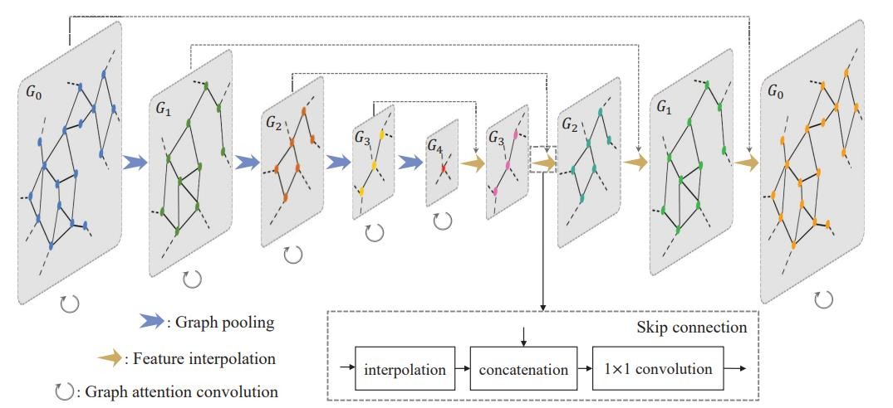

# GACNet_PyTorch
This is the pytorch implmentation of GACNet on S3DIS.

  

## Dependencies
- Python 3.6
- PyTorch 1.7
- cuda 11

## Train Model
Run `python train.py`

## Test Model
Run `python test.py`
